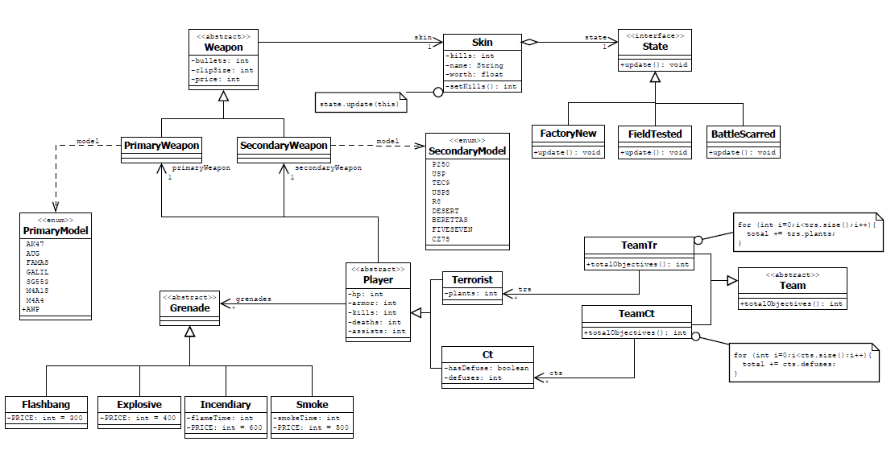

**Trabalho da disciplina Engenharia de Software 2 sob orientação do Prof Dr Enzo Seraphim, no curso de Engenharia da Computação - Universidade Federal de Itajubá.**

**Modelagem e implementação de classes em Java do jogo Counter Strike Global Offensive**

